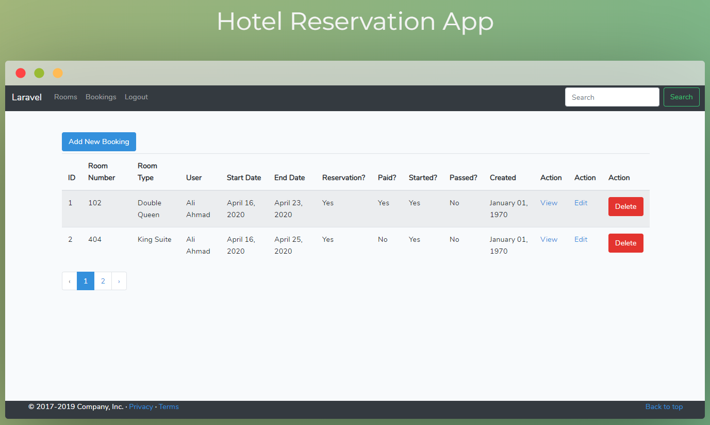

## Features
- Users Management
- Booking Creation,Updation and Deletion
- Hotel Rooms Management
  
## Setting up project
1. Clone to repository using `git clone https://github.com/aliahmadcse/hotel-resv.git`
2. Run the command `composer install` in terminal to install dependencies
3. Create an **.env** file with your own settings. A template is provided in **.env.example** file
4. Now run the app on our local server and enjoy!
5. 